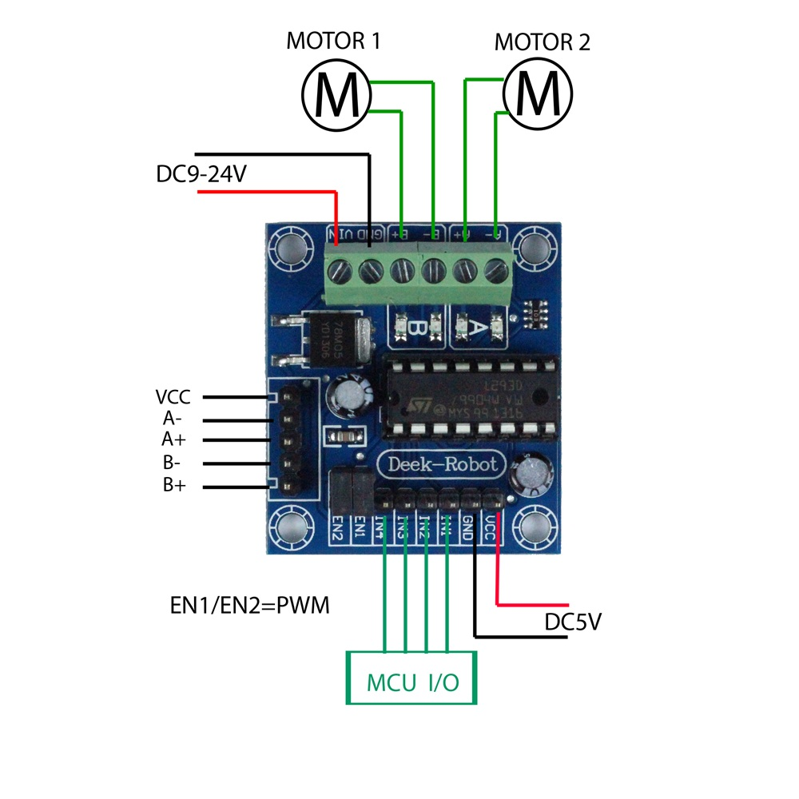

In this lab we will hook up our Deek Robot L239D motor controller up to 
the Arduino Nano.  

You can get the specification on this board here from the Deek Robot site:
http://www.deek-robot.com/productShow.asp?id=17

Here are some key points:
* The input voltage can vary from DC4.5-25V
* The maximum current is 600mA per motor (1.2A peak).  This is well above
what 4 AA batteries will use with our DC motors.  In practice a full speed motor
will draw about 150mA.
* There are small red LEDs on the board that indicate if there is a PWM signal being
received to the board.  You can used this in your debugging.
** If the motor is not turning, but the red LED is on, it indicates the wires
  from the board to the motor may not be connected or their is a problem with the motor.
** If the red LEDs are not lighting up then the may not be a PWM signal getting
to the board.
* You can enable and disable motors 
* The chips have overterperatures sensors so the will shut off if they get too hot

We will then write a program that will test to see if we got each of the 
four wires connected from the motor controller to the correct pins on the Arduino.

Here is the wiring diagram for our robot:



Note that the motors are hooked up to the green "screw header" shown at the top of the diagram.
* The power from your battery is connected to GND (black wire) and VIN (red wire)
* One motor is hooked to the A- and A+
* The other motor is hooked to the B- and B+


The male pins that are at the bottom of the board labeled labeled MCU I/O are on 
the lower side.  These will be labeled IN1, IN2, IN3 and IN4.  IN1 and IN2 should get
the PWM signals from the Arduino.  Only one of the two should get a signal at any time.
One will be for forward and one for reverse.  
Some systems turn both of PWMs on for "break", however
this uses extra power.

Note that the red and black connections here will go to the red and black (or blue) rails of your breadboard.

From the rails you will connect power to your Arduino Nano.

```
/*
Robot Motors Direction Tests
 This test makes sure we get all four of the motor dirction pins correct
 Keep changing these numbers until you get it right directions for each wheel
 Use the serial monitor to verify which one should be working
 Note, On the Arduino Nano, only pins 3,5,6,9,10 and 11 have PWM output.  You must use these to drive the motors.
 See https://www.arduino.cc/en/Main/ArduinoBoardNano
 
 The convention is to use the first four pins (3,5,6,9) for the motor controls
 If you use a ribbon connector the order will be 5,3,6 and 9
*/

int right_forward = 5;
int right_reverse = 3;
int left_forward = 6;
int left_reverse = 9;
int delay_time_on = 2000; // how long should each wheel turn?
int delay_time_off = 2000; // delay between tests

void setup() {
  // Turn these pins on for PWM OUTPUT
  pinMode(right_forward, OUTPUT);
  pinMode(right_reverse, OUTPUT); 
  pinMode(left_forward, OUTPUT); 
  pinMode(left_reverse, OUTPUT);
  // turn all the motors off
  digitalWrite(right_forward, LOW);
  digitalWrite(right_reverse, LOW);
  digitalWrite(left_forward, LOW);
  digitalWrite(left_reverse, LOW);
  // for debugging.  The output will appear on the serial monitor
  // To open the serial monitor, click the magnafing glass icon in the upper right corner
  Serial.begin(9600);      // open the serial port at 9600 bps
}

void loop() {
  Serial.println("Right Forward Test");
  digitalWrite(right_forward, HIGH);
  delay(delay_time_on);
  digitalWrite(right_forward, LOW);
  delay(delay_time_off);
  
  Serial.println("Right reverse test");
  digitalWrite(right_reverse, HIGH);
  delay(delay_time_on);
  digitalWrite(right_reverse, LOW);
  delay(delay_time_off);
  
  Serial.println("Left Forward Test");
  digitalWrite(left_forward, HIGH);
  delay(delay_time_on);
  digitalWrite(left_forward, LOW);
  delay(delay_time_off);
  
  Serial.println("Left Reverse Test");
  digitalWrite(left_reverse, HIGH);
  delay(delay_time_on);
  digitalWrite(left_reverse, LOW);
  delay(delay_time_off);
  
  
}
```

If the the motors are each turning both forward and backward in the order of the
test then you know your connections are correct!
