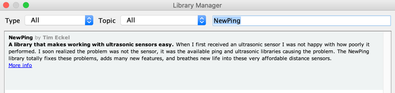

In this lab we will test our ultrasonic distance sensor.

We will be using an Arduino library called the NewPing library.

To load the NewPing library into your Arduino IDE you can use the following menu:

Tools > Manage Libraries...

When the manage libraries window opens you will need to search for the NewPing library by typing "NewPing" into the seach field in the upper right.



Look for the Install menu:


You should then be able to run the following program:

```C
// ---------------------------------------------------------------------------
// Example NewPing library sketch that does a ping about 20 times per second.
// ---------------------------------------------------------------------------

#include <NewPing.h>

#define TRIGGER_PIN  A1  // Arduino pin tied to trigger pin on the ultrasonic sensor.
#define ECHO_PIN     A0  // Arduino pin tied to echo pin on the ultrasonic sensor.
#define MAX_DISTANCE 200 // Maximum distance we want to ping for (in centimeters). Maximum sensor distance is rated at 400-500cm.

NewPing sonar(TRIGGER_PIN, ECHO_PIN, MAX_DISTANCE); // NewPing setup of pins and maximum distance.

void setup() {
  Serial.begin(9600); // Open serial monitor at 115200 baud to see ping results.
}

void loop() {
  // Wait 50ms between pings (about 20 pings/sec).
  // 29ms should be the shortest delay between pings.
  delay(50);                     
  Serial.print("Ping: ");
  Serial.print(sonar.ping_cm());
  // note if result = 0 it is outside of the range of the sensor
  Serial.println("cm");
}
```

The source code is here:
