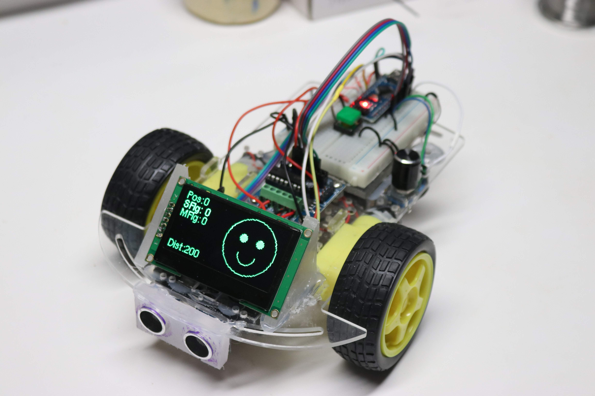

# Adding a Face to Your Robot
This version of our robot has an nice high-contrast OLED screen on the front of it.  We moved the ping
sensor below the chasis so that there would be room top front of the robot for the screen.



We can draw several things on our screen, including a face with two eyes and a mouth using simple
drawing commands.  We can also display the parameters on the screen for controlling the collision avoidance robot.
For example we can display the distance to the object in front of the robot as measured by the ping sensor.
This is a great way to debug our robot.  Rather than hooking up the robot up to the USB connection
to display the robot status on the Arduino serial console we can display the values "in the field"
where the robot is running.

# The 128x64 OLED Screen


Although there are many types of small displays that we can use with the Arduino, our favorite
is the 2.24" 128x64 OLED type.  We like this screen because it has a bright high-contrast display that
is easy to view from all angles and works well under a variety of power conditions.  This is in contrast
to some LCD screens that are difficult to read in bright light and the contrast changes as the batteries
lose power.

You can get this display on E-Bay (as of the end of 2018) for around $17.00 (includes shipping) but we hope
that the prices come down soon since OLED technology is relatively new.

[Sample E-Bay OLED Screen](https://www.ebay.com/itm/2-42-inch-OLED-Display-SSD1309-128x64-SPI-IIC-Serial-Port-Blue-For-Arduino-KO/283274161519)

This version of the OLED has a standard SSD1309 chip that drives it and by default the display is configured to use 
the SPI interface.  There are a few different versions of the OLED displays,
but the ones that are the lowest cost provide for seven SPI connectors:

Serial Peripheral Interface Pins:
1.GND (Power Supply Ground)
2.VCC (Power Supply Positive)
3.SCL (Clock Line/SCK to pin 13 on the Nano)
4.SDA (Data Line/MOSI to pin 11 on the Nano)
5.RES (Reset Line)
6.DC (Data/Command)
7.CS (Chip Select)

To use the Hardware SPI on the Arduino Nano, we MUST connect the SCL to pin 13 and the SDA to pin 11.
See the [Documentation tab](https://store.arduino.cc/usa/arduino-nano) on the Arduino web site.
Note that since the Arduino Nano pin 11 is also a PWM pin we have to run the motors on pins 3, 5, 6 and 9.

This chip is supported by several Arduino libraries, which we will talk about next.

# The u8g2 Monochrome Graphics Library

When I first started using these OLED displays I started out using the Adafruit libraries.  I ran into a problem with
the library using most of my Arduino dynamic memory (about 70% of the 2K available in the Arduino Nano).  
However, I found another library, the u8g2 Monochrome Graphics Library, that only used about 1/3 of the memory.  
This library has a 
[Page Buffer Picture Loop](https://github.com/olikraus/u8g2/wiki/setup_tutorial#page-buffer-mode-picture-loop)
mode that only uses a small amount of RAM.

[U8g2 Github Site](https://github.com/olikraus/U8g2_Arduino)
[U8g2 Wiki](https://github.com/olikraus/u8g2/wiki/u8g2install)

# Configuring the Right Constructor

Getting the right setup for the U8g2 library took some time.  There are several setup options that will work.
The one I chose is the 4-wire hardware SPI.  Hardware interfaces are usually a little bit faster than the software
interfaces but they also required a few more connections.  Here are the options I selected:

1. SSD1306 (the name of the display driver)
2. 128x64 (the size of our display)
3. NONAME (no specific brand name)
4. 1 page (single 128 byte buffer)
5. 4 wire (as opposed to a 2 wire version)
6. Hardware (as opposed to software)
7. SPI (not the IIC interface)

```
// We are using the 128 byte 4W Hardware SPI with no rotation which only uses 27% of dynamic memory
U8G2_SSD1306_128X64_NONAME_1_4W_HW_SPI u8g2(U8G2_R0, CS_PIN, DC_PIN, RDS_PIN);
```

[Setup Constructor Reference](https://github.com/olikraus/u8g2/wiki/u8x8setupcpp#constructor-reference)

# Selecting The Font
The U8g2 library comes with a large number of font to choose from ranging from 4 to 92 pixels high.  
I tried several sizes of fonts and I found the 8 pixel fonts to be large enough to read even from a
looking down at the floor from a standing position.  I also selected a variable with Helvetica font
that I felt was easy to read.
You can read more about the [font installation options here](https://github.com/olikraus/u8g2/wiki/fntlistall)

Here is the setup function that supports initialization of the display and the font selection:

```
void setup(void) {
  u8g2.begin();
  // Set font to Helvetica regular 8 pixel font
  // For other options see https://github.com/olikraus/u8g2/wiki/fntlistall#8-pixel-height
  u8g2.setFont(u8g2_font_helvR08_tf);
}
```

# Simple Test of the Display Connections
Once we have the right constructor and the font initialization setup we are ready to write our first test program.
If this test works, you will know that you have hooked up all seven wires of the display correctly.
The following test program just displays "CoderDojo Rocks" with a counter that increments so you can see
that the display is updating correctly for each loop.

Here is the full program for our simple display test:
```
#include <Arduino.h>
// For details on the o8g2 library see https://github.com/olikraus/u8g2/wiki
#include <U8g2lib.h>
#include <SPI.h>

// order on OLED - GND, VCC, SCL, SDA, RDS, DC, CS
// You can't move these two pins if you use the hardware SPI
#define SCL_PIN 13 // SCL clock - 3rd from bottom
#define SDA_PIN 11 // SDA, Data, MOSI - must be on pin 11 on the Nano
// you can move these pins around as long as you reference the names correctly
#define RDS_PIN 10 // reset
#define DC_PIN 7 // DC moved from pin 9 which is needed as a PWM pin
#define CS_PIN 8 // chip select top

// There are many options for initialzation of the display.  See https://github.com/olikraus/u8g2/wiki/u8x8setupcpp#constructor-reference
// We are using the 128 byte 4W Hardware SPI with no rotation.  This uses 27% of the 2K of dynamic memory available on the Arduino Nano
U8G2_SSD1306_128X64_NONAME_1_4W_HW_SPI u8g2(U8G2_R0, CS_PIN, DC_PIN, RDS_PIN);

int counter; // main loop counter to verify the disply is updating.

void setup(void) {
  u8g2.begin();
  // Set font to Helvetica regular 8 pixel font
  // For other options see https://github.com/olikraus/u8g2/wiki/fntlistall#8-pixel-height
  u8g2.setFont(u8g2_font_helvR08_tf);
}

void loop(void) {
  u8g2.firstPage();
  do {
    // x (horiz) is 0 and 7 (vertical) is 8 down for a 8-pixel high font  
    u8g2.drawStr(0,8,"CoderDojo Rocks!");
    u8g2.setCursor(0,63);
    u8g2.print(counter);
  } while ( u8g2.nextPage() );
  counter++; // increment the counter by 1
}
```

# Testing the Robot Connections
Once you have the display working, we can now use the display to verify that the various components are
each wired up correctly.  The following test are used to test each component:

.1 Ping Sensor Display Test - this test will display the ping sensor distance on the display.
You can use this test to verify that the Trigger and Echo pins are connected correctly.
.2 [Motor Connection Display Test](https://github.com/dmccreary/coderdojo-robots/blob/master/src/oled-ping-bot/_03-motor-display-test/_03-motor-display-test.ino) - this test will cycle through each of the motor controller connections.
It will fist run the right forward motor, then the right reverse motor, then the left forward and
finally the left reverse.  An arrow on the display will show you what wheel should be turning
and in what direction.
.3 Speaker Display Test - this will display a frequency on the display as it plays on the speaker
.4 Rotery Encoder Display Test - this will test the rotary encorder know and the momentary
push buttons that are used to change the mode and select an option.

# Static Integration Display Test
Once all the components are individually working you can then run a "static" or non-moving components together.
This means that all the connections are working but the motor functions are not enabled.


