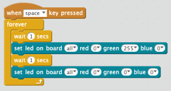
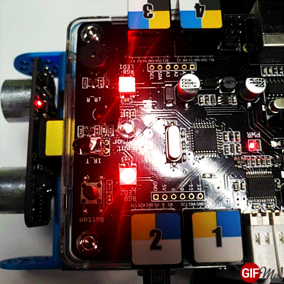

# Blink LED

## Steps
In the example below, the quotes are around the block name and the block parameters are in bold.

1. Drag the "When **space** Key Pressed" block onto the screen.
2. Drag the forever control onto the screen.
3. Add the "Set LED on board **all** red **255**" in the forever block
3. Drag the Wait 1 second block under that
3. Add the "Set LED on board **all** red **0**" in the forever block
4. Add a second wait 1 second block under that

## Sample Program

## Sample GIF Image

## Blink example on Mblock site
[https://www.mblock.cc/example/blink/](https://www.mblock.cc/example/blink/)
