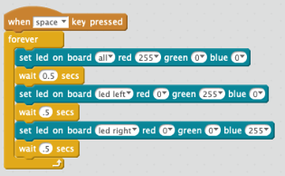
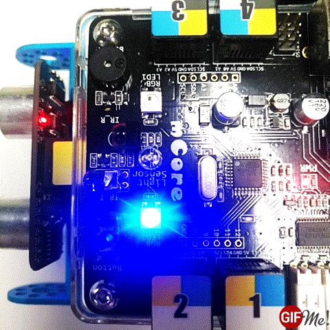

# Alternate Blink LED

In this lab we will make both the LEDs on top of the robot blink red, then green, then blue.  Each color will display for 1/2 second.

## Steps

1. First, drag the "When **space** Key Pressed" block onto the screen.
2. Next, drag the "Forever" block under that block.
3. Next, "Set LED on board **all** red **255**"
4. Under that add a "Wait .5 second" block
3. Next, "Set LED on board "all" green 255"
4. Under that add a "Wait .5 second" block
3. Next, "Set LED on board "all" blue 255"
4. Under that add a "Wait .5 second" block

Now press the "Space" bar on the keyboard.  The block should briefly flash
with a yellow border so you know that the block event has been triggered.

## Sample Block Diagram

## Experiments

1. Can you make the left and right lights alternate?  What happens when you change the "Set LED on board" from "All" to be "Right" or "Left".

