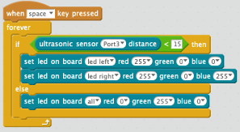

# Green Means Go

This program will make both LEDs turn green if there is nothing in front of the ping sensor.  To do this we will need to place the if <CONDITION> then block inside of the
forever block.  The condition will be the if ultrasonic sensor less than 15.

## Sample Block Program

## Experiments
1. Can you change the LEDs to be different colors?
2. Can you change the left and right LED color separately?
