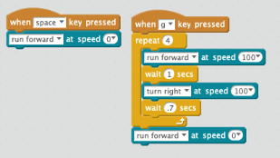

# Drive Square

In this lab we want to make our robot drive in a square each time the letter "g" (for go) is pressed on the keyboard.

To do this we will use a repeat 4 block since there are four sides in a square.  For each side we will drive forward for 1 second and then turn right about .7 seconds.  This will drive in the shape of a square.  We can stop the robot by pressing the space bar.

## Sample Block Program

# mBlock links
[Drive Square Video](https://www.youtube.com/watch?v=zAbU8igcHvg&list=PLuuf1TKEkEqQ9_2hGTHx5XRxlyTOVUJzS&index=9)
