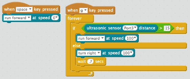

# Collision Avoidance

In the world of teaching robotics, the equivalent of "Hello World!" is the
collision avoidance program.  The idea is to put your robot on the floor
with a set of objects that it must drive around.  The robot must be
going forward if there are no objects in front of it.  But if an object
is in front of it, it will need to turn and drive in another direction.

## Demo Mode 2 (Green LED) Demo
For our mBot, the collision avoidance algorithm can be turned by using Mode 2 where the
top LED lights turn green after pressing the mode switch from the default white mode.  But we want to be able to program our own collision avoidance mode.

## The algorithm

## Block Diagram

## mBot Links and Video
* [mBlock example site](https://www.mblock.cc/example/avoid-barriers/)
* [Collision Avoidance Video on YouTube](https://www.youtube.com/watch?v=vMgXEOiqUWo)
* [Jack Dahms Video: Obstacle Detection and Avoidance](https://www.youtube.com/watch?v=vodYQCeS5Xk)