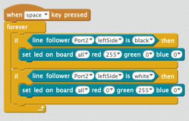

# Line Follower

This is the third demo program (blue LED lights).  When you turn the
mBot on, press the mode button twice.  Then place the mBot on the figure
8 track.

## Sample Block Programs

### Change LED From Sensor

### Line Follower Full

